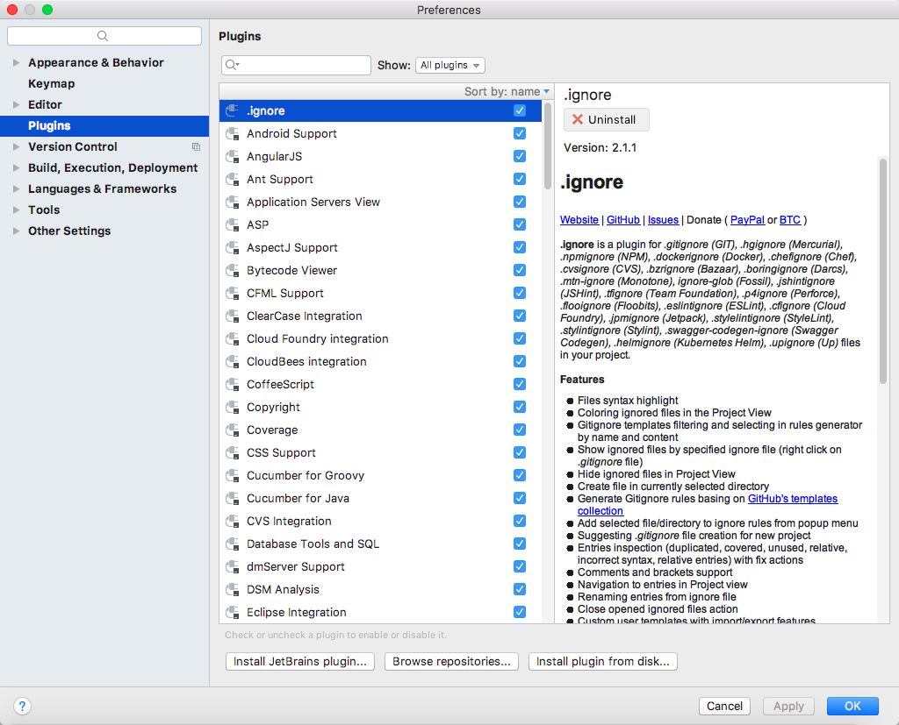
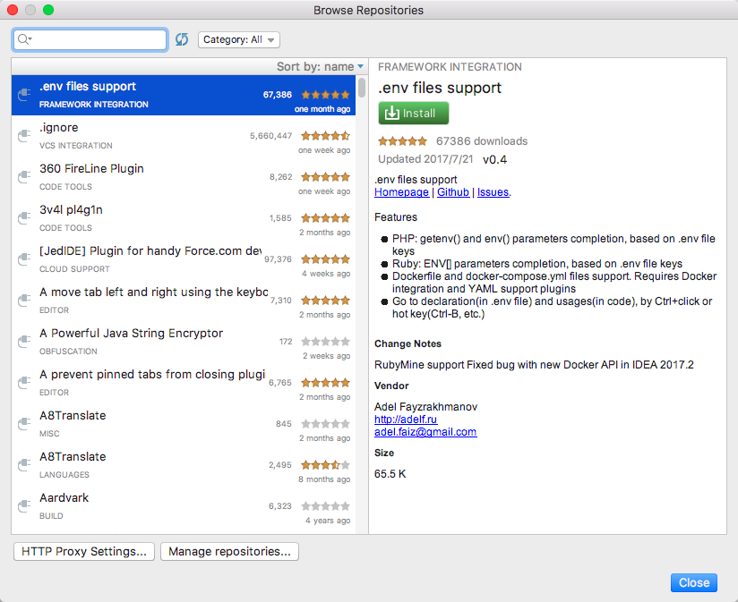
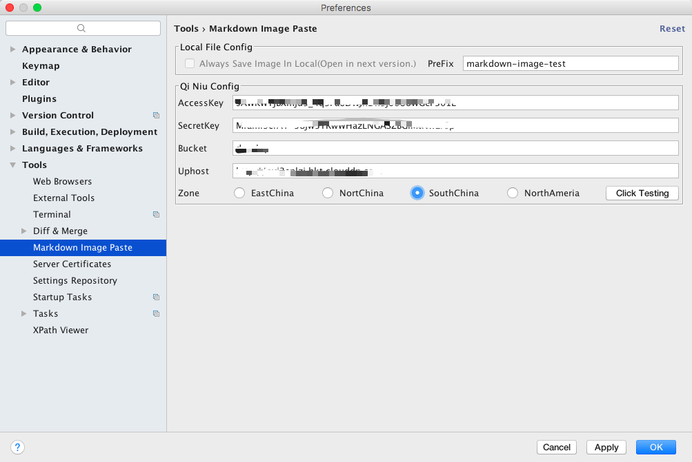
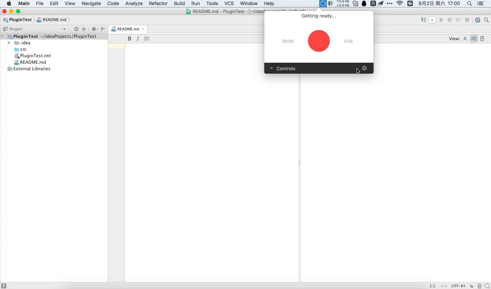

## Markdown Image Paste For InteliJ IDEA

## 简介

如果你是 JetBrains 的死忠或者一名 Java 系程序员的话，那么你对 Android Studio、Intelij IDEA等 IDE 肯定非常熟悉。现在 Markdown 是编写技术文档的利器，但是它有一个致命的缺点，对图片的插入必须得靠插件来实现。前端程序员有 Atom、Sublime Text 等编辑器，可以将图片上传到图床并生成外链，这些 IDE 都非常优秀，有很多图片上传的插件。但不知为什么 InteliJ IDEA 上面这类插件几乎没有，对于 Java 程序员来说如果我们要用到上述功能，还必须安装 Atom、Sublime Text 确实比较麻烦，如果我们的项目中既有 Markdown 文档又有代码需要编写，我们不得不来回切换 IDE，这点确实很繁琐。现在你拥有了此插件可以彻底摆脱对 Atom、Sublime Text 的依赖，让你的注意力集中在 InteliJ IDEA 。

## 特点

#### 新功能（v0.1.0）

* 将剪切板的图片上传至七牛云
* 自动生成外链并粘贴到当前文档

## 安装

安装方式很简单，一种是下载我发布的 jar，这种方式适合你在没有网络的环境下安装，还有一种是 Intelij IDEA 的插件仓库中查找并安装。需要注意的是，安装完插件之后需要重启才能生效，这对于所有的插件来说都一样。

#### 离线安装

你可以在本项目的 [Release](https://plugins.jetbrains.com/plugin/10001-markdown-image-paste) 中下载最新的 ZIP 包，然后在 InteliJ IDEA 的 Plugins 界面中点击 'Install plugin from disk'，然后在弹出的选项框中选择下载好的 jar 包加载即可。

#### 在线安装

在 InteliJ IDEA 的 Plugins 界面中选择 'Browse repositoreis' 浏览在线仓库，在搜索框中输入该插件的名称选择安装即可。

## 配置

为了将图片上传到对应的图床，我们需要填写相关的配置，目前只支持七牛云，在后续版本中会添加对其它图床的支持。你可以打开 InteliJ IDEA 的 Preferences，然后点击 Tools 选项框，在此类目的列表下你会看到 Markdown Image Paste 的设置项。

#### 本地文件配置

| 配置项 | 说明 |
| --- | --- |
| PreFix(前缀) | 此配置项会影响你文件名，文件的后缀为时间戳并且不允许用户修改 |

#### 七牛云配置

| 配置项 | 说明 |
| --- | --- |
| AccessKey | 你可以在七牛云中的秘钥管理中找到 |
| Secretkey | 该参数与 AccessKey 在一起 |
| Bucket | 该参数你的存储空间，你可以在存储空间列表中看到他们 |
| Uphost | 上传的主机，是七牛云图片所存储的主机，默认情况下我们无法知道存储空间的主机是什么，所以需要用户自行填写，如果填写错误会造成生成的外链的地址有误。|
| Zone | 该参数为你存储空间所在的区域，目前有四个区域 EastChina(华东)、NorthChina(华北)、SouthChina(华南)、NorthAmerica(北美)。|

* AccessKey 与 SecretKey 所在的位置

* Bucket、Uphost、Zone 所在的位置

## 使用

该插件只会在 Markdown 文档中粘贴时才会进行响应。目前的快捷键是 'Ctrl + V'（Windows）、‘Command + V’（Mac） ，后续添加自定义快捷键功能。

## 测试

该插件没有在很多的环境下测试过，如果你在使用的过程中发现问题，可以在项目的 [Issues](https://github.com/ITGrocery/markdown-image-paste/issues) 中提出你的问题，我会尽快回复并处理。

| 操作系统 | JDK | IDE |
|--- | --- | --- |
| macOS Sierra 10.12.6 | Oracle JDK 1.8.0_144 | InteliJ IDEA ULTIMATE 2017.2

## 参考

* [pasteimages](https://github.com/holgerbrandl/pasteimages)
* [activate-power-mode](https://github.com/ViceFantasyPlace/activate-power-mode)
* [AndroidWiFiADB](https://github.com/pedrovgs/AndroidWiFiADB/blob/master/.travis.yml)
